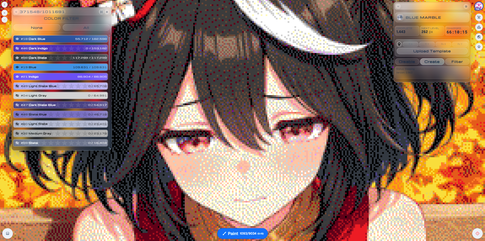

# Blue Marble Enhanced

This fork is based on [SwingTheVine/Wplace-BlueMarble](https://github.com/SwingTheVine/Wplace-BlueMarble) and focuses on practical improvements for everyday template work on [wplace.live](https://wplace.live/).

The goal is not to replace the upstream project. This fork keeps the original Blue Marble workflow, then adds usability, workflow, and Color Filter improvements on top.

## What Is Different

Version `0.95.0` continues the enhanced release:

- Redesigned Blue Marble windows with a minimal liquid-glass visual style.
- Redesigned window controls, buttons, typography, spacing, and transitions.
- Polished the main Blue Marble header and stat cards for a more balanced layout.
- Added a resizable windowed mode for Color Filter.
- Redesigned the expanded Color Filter layout with compact stat cards and full-color color cards.
- Added Color Filter position and size persistence.
- Added persistence for shown and hidden colors in Color Filter.
- Added automatic Color Filter refresh every 10 seconds.
- Updated Color Filter visibility icons with animated eye-slash transitions.
- Added premium color star backgrounds in the expanded Color Filter cards.

## Installation

Install the latest userscript from the release page:

[Download the latest release](https://github.com/alexeygasenko/Wplace-BlueMarble/releases/latest)

Use `BlueMarble.user.js` with a userscript manager such as Tampermonkey, then refresh [wplace.live](https://wplace.live/).

## Color Filter

Color Filter is one of the main areas improved here. It can be opened as a compact window, resized, moved around the canvas, and restored with the same size and position the next time you use it.

Hidden and visible colors are remembered, so you can isolate the colors you are actively painting without rebuilding the filter state every session. The list also refreshes automatically every 10 seconds, keeping pixel counts current without a manual refresh button.

The expanded Color Filter view now uses larger full-color cards, compact progress text, clearer stat cards, animated visibility icons, and premium star accents while keeping hidden colors recognizable by their actual palette color.

## Upstream

Original project:

[SwingTheVine/Wplace-BlueMarble](https://github.com/SwingTheVine/Wplace-BlueMarble)

This fork keeps the original license and credits. For upstream documentation, contribution rules, and project background, refer to the original repository.

## License

Blue Marble is licensed under the Mozilla Public License 2.0. See [LICENSE.txt](./LICENSE.txt).
