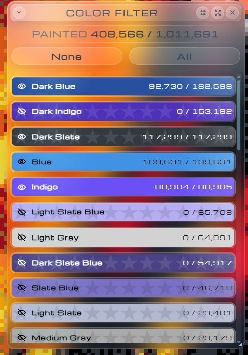

# Blue Marble Enhanced

Color Filter now has a horizontal layout for faster scanning across large color sets.

The vertical windowed layout keeps the full list compact, clear, and easy to browse.

The expanded view turns Color Filter into a full overview with larger cards and richer stats.

Blue Marble Enhanced is a practical fork of [SwingTheVine/Wplace-BlueMarble](https://github.com/SwingTheVine/Wplace-BlueMarble) for [wplace.live](https://wplace.live/).

It keeps the original Blue Marble workflow and adds a cleaner UI, better window behavior, and a more capable Color Filter.

## Highlights

- Refined liquid-glass window design across the main window, Color Filter, and Settings.
- Improved Color Filter with fullscreen and windowed layouts.
- Resizable and movable windowed Color Filter with saved size, position, and layout.
- Remembered shown and hidden colors.
- Custom sort controls and refreshed Color Filter stats.
- Improved Settings window styling and controls.

## Installation

Install the latest userscript release:

[Download latest release](https://github.com/alexeygasenko/Wplace-BlueMarble/releases/latest)

Use `BlueMarble.user.js` with a userscript manager such as Tampermonkey, then refresh [wplace.live](https://wplace.live/).

## Upstream

Original project:

[SwingTheVine/Wplace-BlueMarble](https://github.com/SwingTheVine/Wplace-BlueMarble)

This fork keeps the original license and credits.

## License

Blue Marble is licensed under the Mozilla Public License 2.0. See [LICENSE.txt](../LICENSE.txt).
